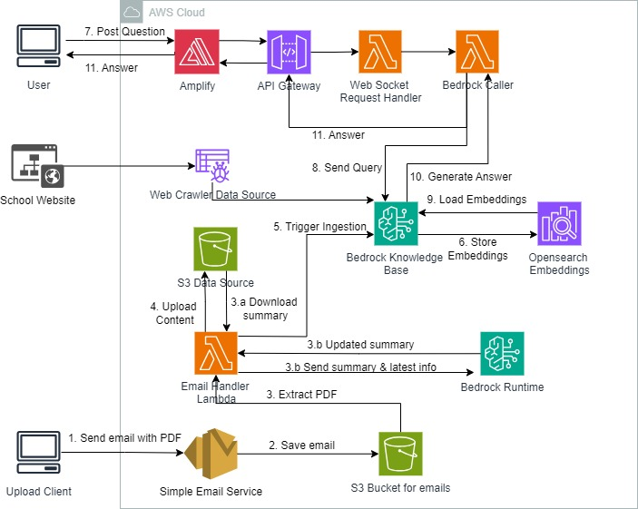

# Kelvyn Park Chat Assistant

A multi-lingual chat assistant for Kelvyn Park Junior and Senior High School that supports English and Spanish.



## Overview

This chatbot is implemented using Amazon Bedrock Knowledge Base with Claude 3 Haiku as the foundation model to facilitate real-time information exchange. The system architecture is designed to provide up-to-date information about the school through various data sources and a user-friendly interface.

### Key Components:

1. **Data Sources**:
   - Amazon S3: Handles PDF and XML files like handbooks and newsletter summary.
   - Web Crawler: Extracts information from the school website.

2. **Automatic Data Ingestion**:
   - School documents (handbooks, newsletters) are automatically ingested and synced to the data source using Amazon Simple Email Service.

3. **Knowledge Base**:
   - Utilizes Amazon Bedrock Knowledge Base to store and manage information.
   - OpenSearch Embeddings are used to enhance search capabilities.

4. **Language Model**:
   - Claude 3 Haiku serves as the foundation model for natural language processing to understand user queries and generate responses.
   - Cluade 3.5 Sonnet is used to create a rich summary of the school newsletters in XML format which is used as one of the data sources for the Bedrock Knowledge Base.

5. **User Interface**:
   - Web interface created using React.
   - Deployed using Amazon Amplify for seamless user experience.

6. **Backend Communication**:
   - Implements WebSocket API using Amazon API Gateway for real-time communication between frontend and backend.

## Architecture Flow

1. Upload Client sends an email with PDF to Simple Email Service.
2. Email is saved in S3 Bucket for emails.
3. Email Handler Lambda extracts PDF and generates its summary using Claude 3.5 Sonnet.
4. Content is uploaded to S3 Data Source.
5. This triggers ingestion into Bedrock Knowledge Base.
6. Embeddings are stored in OpenSearch.
7. User posts a question through the web interface.
8. Query is sent to Bedrock Knowledge Base.
9. Relevant embeddings are loaded.
10. Bedrock Caller generates an answer using Claude 3 Haiku.
11. Answer is streamed back to the user through API Gateway and Amplify.

## Pre-requisites

1. AWS CLI (version 2.15.57 Python/3.11.8 Windows/10 exe/AMD64)
2. AWS Account with Administrative User configured, region us-west-2
3. Node.js (version 20.15.1)
4. Typescript 3.8 or later
5. Docker
6. IDE like VSCode (recommended)
7. AWS CDK Toolkit (version 2.148.1)
8. GitHub access token with repo access
9. AWS SES domain identity
10. Claude 3 Haiku and Claude 3.5 Sonnet models in Amazon Bedrock

## Set up on local machine

1. Clone this repository
```bash {"id":"01HTZEMSE9DJB4D5JMBQWRGP9B"}
  git clone https://github.com/ASUCICREPO/kelvyn-park-chat-assistant.git
```
2. Go into the repository directory
```bash {"id":"01HTZEMSE9DJB4D5JMBQWRGP9B"}
  cd kelvyn-park-chat-assistant
```
3. Install dependencies
```bash {"id":"01HTZEMSE9DJB4D5JMBQWRGP9B"}
  npm install
```
4. Deploy to the default environment with the GitHub token and SES domain identity name values in context variables.
```bash {"id":"01HTZEMSE9DJB4D5JMBQWRGP9B"}
  cdk deploy -c githubtoken=<your_github_access_token> -c domain=<your_domain>
```
5. In your AWS Account, go to Amazon Bedrock->Knowledge Base-> <Your Kelvyn Park Knowledge Base> -> Data Sources -> Add. Select Web Crawler->Next. In Data Source Name field enter "kp-website-datasource" and in Source URLs enter "https://kphermosa.org/". Select Website Domain Range in Synch Scope as "Default" and go forward to Add the data source to your knowledge base. Select the newly added datasource and run synch job.
6. Go to AWS Amplify and got to your amplify app. Run deployment on the "main" branch.
7. Go to the SES Rule set and verify that it is set to "Active".
